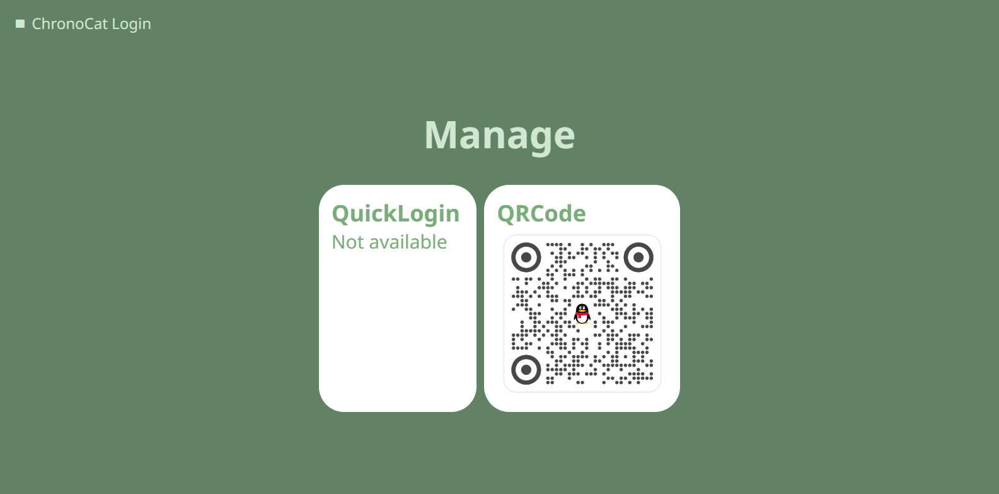

import Link from '@docusaurus/Link'

Chronocat v0.0.50 现已可用！本次更新我们带来了许多全新的功能，包括远程登录、Headless
模式（无头模式）、官方 Docker 镜像、新的 Satori 协议，以及其他一系列改进。

{/* truncate */}

让我们来一起看看这些新功能。

## 远程登录

首先要进行介绍的就是「远程登录」功能。「远程登录」允许你在浏览器内进行 QQ 的登录。当你在指定
Chronocat 工作模式的命令行参数或环境变量中附加 `login` 开关时，Chronocat
会在控制台打印一个链接，你可以使用这个链接进行登录。



在 [启动](/launch) 一节了解更多详情。

## Chronocat Headless（无头模式）

有了远程登录的功能，我们就可以彻底抛弃 QQ 界面了。接下来要介绍的功能就是 Chronocat
Headless（无头模式）。在 Chronocat 工作模式参数中附加 `headless3` 开关，Chronocat
就会以无头模式启动，同时也会自动启用远程登录功能。由于不再显示界面，Chronocat
所需的内存也会大大降低。

需要注意的是，无头模式现在仍然处在「实验性功能」阶段。目前，只有模式
3（`headless3`）可供使用。你可以随意测试此功能，但我们不建议立即将此功能用于生产环境。
我们将在未来持续探索无头模式的更多可能性，并力求进一步降低内存占用。

在 [启动](/launch) 一节了解更多详情。

## Chronocat Docker

对于这样一个无需 GUI 的 Chronocat，将其容器化就变得轻而易举。同时，[LiteLoaderQQNT](https://llqqnt.mukapp.top)
优秀的跨平台和跨版本特性也为 Chronocat 的容器化提供了可能。在这次更新中，我们推出了由
Chrononeko 团队开发和维护，基于 LiteLoaderQQNT 的 Chronocat 官方镜像——`chronoc/at`。你可以立即尝试：

```sh
# 创建一个目录作为 Chronocat 的数据目录，并在目录内执行：
docker run -it --name chronocat -p 16530:16530 -p 5500:5500 -p 16340:16340 chronoc/at
```

Chronocat 会随即启动并打印远程登录的链接，点击链接即可登录
QQ。之后，即可立即开始使用 Satori 和 Red 服务了。

目前版本的容器会占用约 250MiB 内存。随着无头模式的更新，未来的容器内存占用有望进一步降低。


在 [Docker 安装](/install/docker/official) 一节了解更多详情。

## Satori Protocol

Satori Protocol 是一个通用的、跨平台的聊天协议。从 v0.0.50 开始，Chronocat 将 Satori 作为推荐使用的协议实现。

与 RedProtocol 相比，Satori 有几个显著的优势：

- **简洁**。与 RedProtocol 力求提供全部可提供的信息不同，Satori 对事件结构和 API
  的调用方式进行了精心设计，你甚至能在不阅读任何文档的情况下理解 Satori 的数据结构。
- **稳定**。RedProtocol 在大部分情况下会将 API 调用的结果直接返回，因此同一 API 在不同版本 QQ
  之间的表现可能会有较大的差异。与此同时，Satori 会力求保证每一个字段的稳定性，使你只需参考文档就可完成代码编写。
- **统一**。Satori 对聊天平台进行了高度抽象，使你能使用统一的方式完成需求——使用单一的发送消息接口，
  你可以完成文本、图片、音频甚至是合并转发的发送。
- **跨平台**。在 Chronocat 之外，Satori 已经支持了国内外所有主流的聊天平台。基于 Satori
  进行开发的机器人可以轻松移植到 QQ 群、QQ 频道、Kook 以及 Discord 和 Telegram 等主流聊天平台。

在 [Satori](/develop/satori/) 一节了解更多详情，或直接前往 [Satori 官网](https://satori.js.org/zh-CN/) 了解详情。

当然，如果你目前仍在使用 RedProtocol——无需担心！对于现有的基于 RedProtocol
的框架和适配器，我们仍将继续提供更新和支持。你可以自由决定迁移到 Satori 的时机。

## 其他改进

除了上面提到的新功能以外，我们还在其他许多小的方面进行了改进。这里列举了一些：

- Chronocat 服务密码（token）需要在首次启动之后打开配置文件获取，这增加了框架和适配器对接
  Chronocat 的难度。现在，Chronocat 首次启动时支持使用 `--chrono-default-token` 和
  `CHRONO_DEFAULT_TOKEN` 设定初始服务密码，框架和适配器可以利用此功能生成初始密码，而无需等待
  Chronocat 自行生成。
- Red 协议新增了 API `bot/exit`，可用于普通环境下关闭 QQ，或容器环境下重启 QQ。
- 随着 v0.0.50 的推出，本站也进行了完全的重构；目前，文档仍有许多内容尚未编写完毕。
  我们会在未来一段时间尽快编写文档；如果你急需某部分的文档，那么你随时都可以通过
  [社区](/more/community) 途径反馈给我们，我们会优先编写你需要的内容！

当然，除此之外，我们还有一些已实装但未发布的小功能，等待大家自行探索。

## 未来

这个版本只是 Chronocat v0.0.50 系列的开始，未来 Chronocat
也将会有更多激动人心的功能加入——其中的一些功能甚至已经进入了早期的开发阶段。任何
Chronocat 的大型更新或新增功能都会在此博客发布，所以不要错过！

## 立即尝试

Chronocat v0.0.50 已经可用！你现在就可以前往安装或更新 Chronocat。

<Link
  className="button button--secondary button--lg button--normal"
  to="/install"
>
  <span>前往安装</span>
</Link>

## 遇到问题？

如果在使用 Chronocat 的途中遇到了任何问题，你都可以通过 [社区](/more/community)
途径反馈给我们，我们将尽力解决你的问题！

## 致谢

在 Chronocat v0.0.30 到 v0.0.40 的这段时间里，在 Chrononeko 团队之外，还有以下两位小伙伴对
Chronocat 做出了贡献：

- [@Hieuzest](https://github.com/Hieuzest)
- [@XiYang6666](https://github.com/XiYang6666)

感谢你们的贡献。

除此之外，以下两位小伙伴在官方 Docker 镜像推出之前自行制作了 Chronocat
镜像，为官方镜像提供了非常优秀的参考：

- [@yuuki-nya](https://github.com/yuuki-nya)
- [@he0119](https://github.com/he0119)

同样感谢你们。

最后，还要感谢在这条道路上坚持探索的大家——以及看到这里的你——是你们让 Chronocat
变成可能。谢谢！
