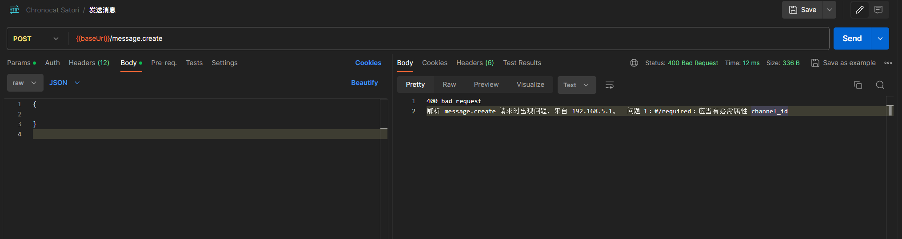

import Link from '@docusaurus/Link'

虽然 Chronocat v0.2 发布距今已经过去了近一个月，但仍然有必要介绍 v0.2 的更改。我们一起来看一看。

{/* truncate */}

## 引擎

Chronocat v0.2 进行了完全的重写，其中最重大的变化就是「引擎」的引入。

Chronocat v0.2 由 Chronocat Shell 和多种引擎组成。其中，Chronocat Shell
负责与功能实现无关的逻辑，例如配置文件的读取、Satori 服务的启动和管理和 API
调用参数的校验等。具体功能的实现由各个引擎负责。

Team Chrononeko 开发和维护的引擎可以在 [「安装引擎」页面](/guide/install/engine) 查看。目前有三个引擎可供使用：

- **chronocat-api**：实现了 Satori 服务的绝大多数 API，包括发送消息和各类查询 API。
- **chronocat-event**：实现了事件的监听和推送。
- **poke**：实验性的引擎，实现了戳一戳消息的接收。

新架构给 Chronocat 提供了这些优势：

- **引擎的自定义搭配**：如果你只想实现 RSS 推送，或者你只想存档群内聊天，那么你可以分别只安装
  choronocat-api 或 chronocat-event 引擎，即可实现你的需求。
- **功能实现与 Shell 解耦**：各个引擎可以独立更新功能，不需要修改 Chronocat Shell 代码。
- **为更多引擎做准备**：未来 Chronocat 会有更多引擎加入，新的引擎可以直接支持当然版本的 Chronocat
  Shell；这意味着新的引擎发布后你可以直接下载安装新的引擎，而无需先升级 Chronocat Shell 或现有引擎。

我们马上将会有一个新的引擎发布，不要错过！

## 数据结构校验

除了上述的架构更改外，v0.2 新增的一个主要功能就是对请求数据结构的校验。现在，所有 API
请求都会先进行校验，验证合法之后才会被传入运行。数据结构使用 TypeScript
定义，同一份代码会被同时用于传入参数的校验和官网文档的生成。这从根本上保证了 Chronocat API
文档中指示的参数与实际验证的参数之间的一致性。此外，如果结构校验出现错误，错误会以 400
错误码+中文说明的方式直接返回，极大地方便了临时使用或代码调试等场景下的 API 请求。下图是一个使用 Postman
查看结构校验错误的示例。

## Red 服务的移除

在 [Chronocat v0.1 发布](/blog/010) 中我们已经提到，Chronocat v0.2 将会移除 Red 服务。除了 Red
协议自身的问题以外，Chronocat v0.2 的新架构也是我们无法继续提供 Red 服务的一个原因。

Red 协议是 QQ 内部使用的协议，而 chronocat-api 和 choronocat-event 两个引擎内部会使用 Red
数据结构进行消息的解析和处理。在 v0.2 中，除了上述两个引擎以外，其他引擎均不使用 Red
数据结构进行消息处理。

这就产生了一个问题： **若要支持 Red 服务，那么其他引擎需要将自己的数据结构手动转换为 Red！**

手动转换为 Red 结构听起来是可行的，然而实际上并不是。这是由于 Red 协议自身的定位所导致的：Red
协议会直接反映 QQ 内部的数据结构，以提供最全的数据支持。这一点在 [v0.0.50 发布](/blog/0050)
中已有提到。这意味着，Red 的数据结构会随着 QQ 的版本更新而发生更改——实际上，几乎每次的 QQ
更新都会伴随着数据结构更改。这意味着 **没有一种稳定的结构可以用来转换到 Red**。

以戳一戳引擎为例，虽然现在可以在 Red 内添加自定义字段，但如果未来 QQ
更新提供了其他字段，那么是否适配 QQ 官方的新字段就会变成问题。
**适配意味着这对现有 Bot 是破坏性更改，而不适配意味着 Red 将无法正确反映 QQ 内部的数据结构，还可能与 QQ 未来的更新出现冲突。**
这是我们最终选择放弃 Red 服务的原因。

Chronocat v0.1 将会继续更新，同时提供 Red 服务支持。有需要使用 Red 的小伙伴仍然可以在 v0.1 文档页面下载到 Chronocat v0.1。

## 旧代码逻辑的弃用

Chronocat v0.0.x 中有很多陈旧代码，这些代码随着 QQ 自身的升级已不再需要使用，移除这些代码也可以增加 Chronocat
的稳定性。Chronocat v0.2 移除了这些无用代码。未来，我们也会把这些更改同步至 Chronocat v0.1。

## 立即尝试

目前 Chronocat 的最新版本为 v0.2.7，你现在就可以前往安装或更新 Chronocat。

<Link
  className="button button--secondary button--lg button--normal"
  to="/guide/install/shell"
>
  前往安装
</Link>

## 遇到问题？

如果在使用 Chronocat 的途中遇到了任何问题，你都可以通过 [社区](/more/community)
途径反馈给我们，我们将尽力解决你的问题！

## 致谢

一如既往地感谢在这条道路上坚持探索的大家——以及看到这里的你——是你们让 Chronocat
变成可能。谢谢！
