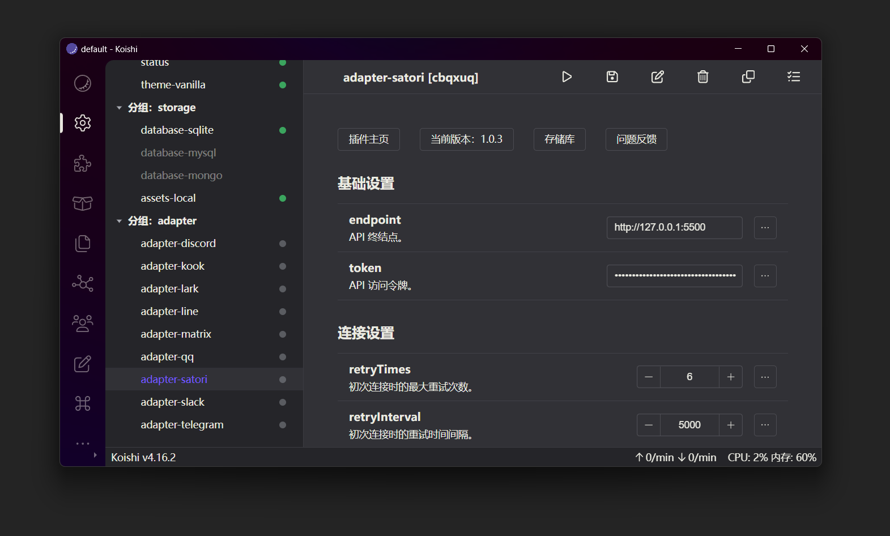

[Koishi](https://koishi.chat) 是一个跨平台、可扩展、高性能的聊天机器人框架。

Koishi 内置了 Satori 适配器，可以直接使用 Satori 适配器接入 Chronocat。

添加一个 `adapter-satori` 插件，`endpoint` 填写 Chronocat 开启 Satori
服务的地址，`token` 填写 Satori 服务的 token。点击右上角的「启动插件」，即可连接到 Chronocat。
