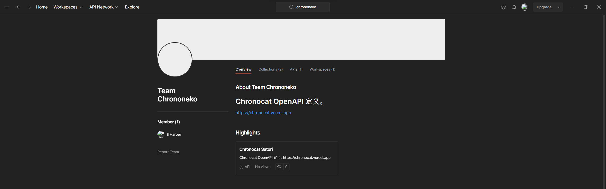
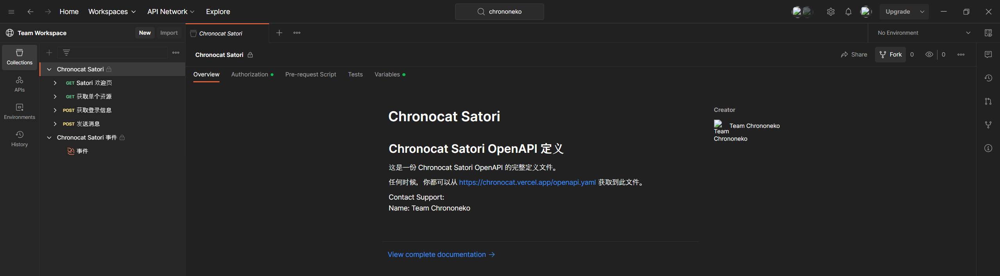
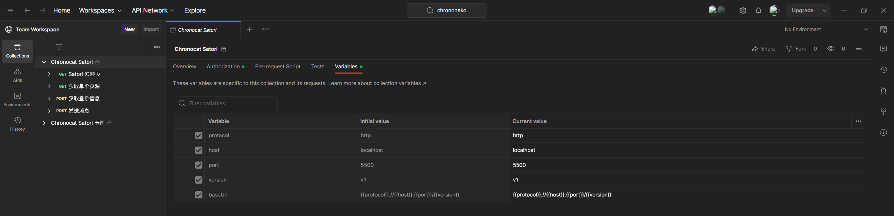
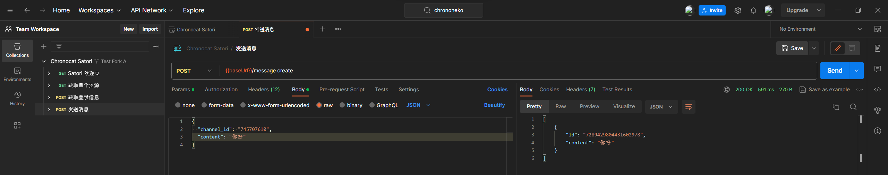
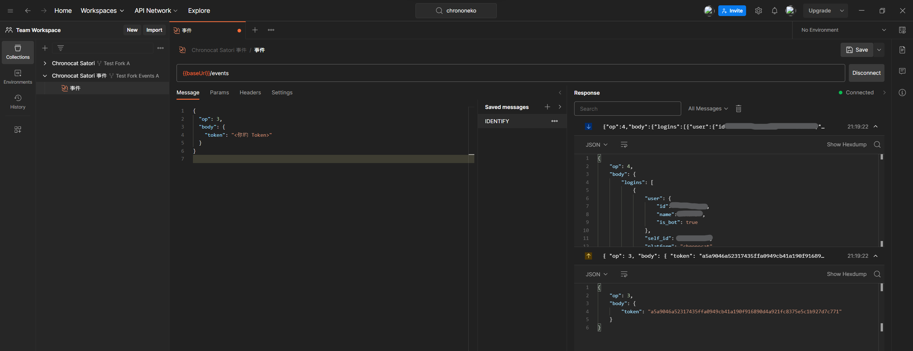

import Link from '@docusaurus/Link'
import Tabs from '@theme/Tabs'
import TabItem from '@theme/TabItem'
import { AreaDevelop } from '@site/src/components/AreaDevelop'
import { Constructing } from '@site/src/components/Constructing'

<AreaDevelop />

本节简单介绍了使用 Satori 发送消息和接收消息的基本步骤。阅读本节之前，你需要安装并运行 Chronocat。

你可以使用你熟悉的 API 测试工具来进行 API 的测试，或直接使用你熟悉的语言进行尝试。

## 发送消息

让我们先从发送一条「你好！」的消息开始。

<Tabs groupId="api-tools">
<TabItem value="postman" label="Postman">

首先，打开 Postman 上的 Team Chrononeko。

<Link
  className="button button--secondary button--lg"
  to="https://www.postman.com/chrononeko"
>
  <span>Postman 上的 Team Chrononeko</span>
</Link>



点击「Chronocat Satori」，打开 Chronocat Satori 的 API 页面。

接着，点击「Collections」，点击「Chronocat Satori」，然后点击右上角的「Fork」按钮，复刻一份
Chronocat Satori 服务。



复刻后，点击选项卡中的「Variables」。在这里根据你的 Satori
服务所处的位置填写各个变量；如果你使用本机 Chronocat，那么无需修改这里的配置。



修改完成之后，点击右上角的「Save」按钮，保存你对变量做出的修改。由于你使用的是你自己复刻后的
API 集合，你的变量数据不会泄漏。

接下来，点击左侧栏的「发送消息」，然后点击选项卡上的「Body」，将 `channel_id`
替换为测试群的群号，`content` 替换为 `你好`。点击右侧的「Send」按钮，你会看到消息成功发送。



</TabItem>
<TabItem value="none" label="不使用工具">

<Constructing />

</TabItem>
</Tabs>

## 接收消息

Satori 通过 WebSocket 实现事件分发，因此我们需要建立 WebSocket 连接。

<Tabs groupId="api-tools">
<TabItem value="postman" label="Postman">

回到 Postman 上的 Team Chrononeko 页面，仍然点击「Chronocat Satori」，打开
Chronocat Satori 的 API 页面。

这次，点击「Collections」，点击「Chronocat Satori 事件」，然后点击右上角的「Fork」按钮，复刻一份
Chronocat Satori 事件服务。


复刻后，点击选项卡中的「Variables」。在这里根据你的 Satori
服务所处的位置填写各个变量；如果你使用本机 Chronocat，那么无需修改这里的配置。


修改完成之后，点击右上角的「Save」按钮，保存你对变量做出的修改。由于你使用的是你自己复刻后的
API 集合，你的变量数据不会泄漏。

接下来，点击左侧栏的「事件」，然后在「Message」选项卡中填写下面的消息：

```json
{
  "op": 3,
  "body": {
    "token": "<你的 Token>"
  }
}
```

点击右侧的「Connect」按钮，紧接着点击右下角的「Send」按钮，你会看到 Postman
成功发送了认证消息，且 Chronocat 已经成功认证，开始推送事件。你现在可以接收消息了。



</TabItem>
<TabItem value="none" label="不使用工具">

<Constructing />

</TabItem>
</Tabs>
