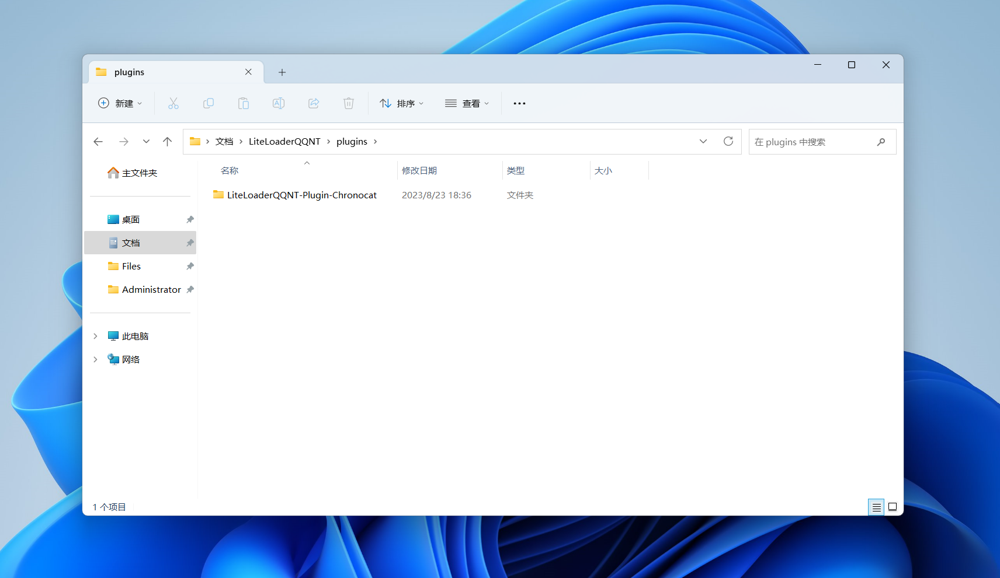
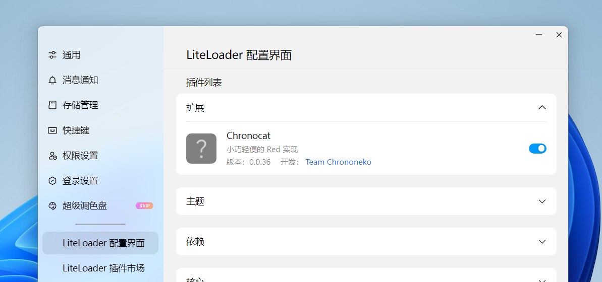

import Link from '@docusaurus/Link'
import { UntrustedContents } from '@site/src/components/UntrustedContents'

## 步骤 1：安装 LiteLoaderQQNT

<UntrustedContents />

LiteLoaderQQNT 提供了详细的安装教程，可以直接前往 LiteLoaderQQNT 的主页查看。

<Link
  className="button button--secondary button--lg"
  to="https://llqqnt.mukapp.top"
>
  前往 LiteLoaderQQNT
</Link>

结论：你已安装 LiteLoaderQQNT。

## 步骤 2：安装 Chronocat

前往下方的 Chronocat 下载页，下载适用于新版 LiteLoaderQQNT 的 Chronocat LiteLoaderQQNT
插件。文件名应当类似 `chronocat-llqqnt-v0.0.0.zip`。

<Link
  className="button button--secondary button--lg"
  to="https://github.com/chrononeko/chronocat/releases"
>
  前往 Chronocat 下载页
</Link>

下载完成后，将文件解压到 `文档/LiteLoaderQQNT/plugins`
目录下。此时该目录下应当具有 `LiteLoaderQQNT-Plugin-Chronocat`
文件夹。如果文件夹的名称不正确，你需要检查是否多解压或少解压了文件夹。

## 步骤 3：启动 QQ

启动 QQ 并登录机器人的账号后，在左下角的菜单中点击「设置」。

打开「LiteLoader 配置界面」，然后点击「插件列表」下方的「扩展」，确保 Chronocat
已安装并已启动。

结论：Chronocat 已成功安装在你的 QQ 上。

接下来，你可以将 Chronocat 接入你喜爱的应用或框架。

<Link
  className="button button--secondary button--lg button--normal"
  to="/connect"
>
  前往接入
</Link>
