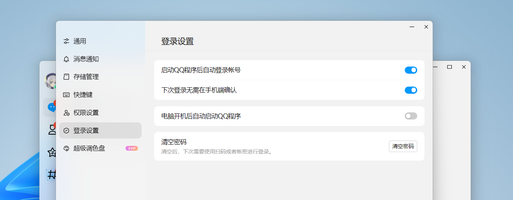

import Link from '@docusaurus/Link'
import DocCardList from '@theme/DocCardList'

安装 Chronocat 只需要三步。

## 步骤 1：安装 QQ

在你的电脑上安装最新版本的 QQ。

<Link className="button button--secondary button--lg" to="https://im.qq.com">
  前往 QQ 官网
</Link>

**如果你的电脑上已经存在旧版本的 QQ，请先退出旧版 QQ。旧版 QQ 会自动升级，升级会保留所有数据。**

下载安装包后直接双击后点击「立即安装」即可开始安装过程。

结论：你已安装完 QQ。

## 步骤 2：登录机器人账号

启动 QQ，并登录你的机器人账号。

登录账号之后，在左下角的菜单中点击「设置」。

点击左侧栏中的「登录设置」，并打开「下次登录无需在手机确认」选项。如果你将这台电脑上的 QQ
专用于搭建机器人，你还应该打开「启动 QQ 程序后自动登录账号」选项。

最后，右击通知区域中的 QQ 图标，然后点击「退出」。

结论：你已在 QQ 上登录了机器人账号，并打开了相应的设置项。

## 步骤 3：安装一个插件框架

你可以任意选择一个插件框架。

<DocCardList />
