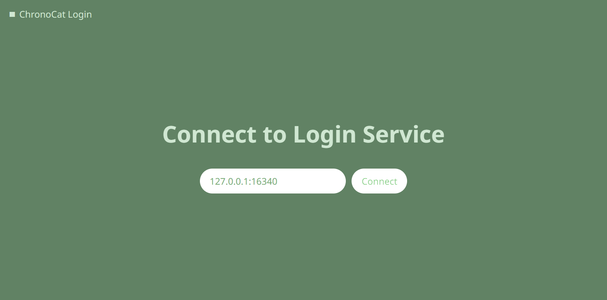

import { Unsafe } from '@site/src/components/Unsafe'

Chronocat 提供了多种启动方式，你可以根据自己的需求进行选择。

## 常规启动（推荐）

在你没有特殊需求的情况下，我们总是推荐使用常规方式启动 Chronocat。

直接点击「QQ」进行启动即可。QQ 启动并登录账号后，Chronocat 会自动启动。

直接使用浏览器访问 Chronocat 启动的 Satori 服务即可判断 Chronocat 是否正在运行。

## 远程登录

如果你希望在正常启动 QQ 的同时使用 Chronocat 进行 QQ 登录，则可以选择远程登录。

启动 QQ 时附加如下的命令行参数或环境变量，则 Chronocat 将启用远程登录。

```sh
./QQ --chrono-mode=login
```

```ini
CHRONO_MODE=login
```

启动时，Chronocat 会在控制台打印一个链接，链接包含了登录服务使用的端口和服务密码，你可以使用这个链接进行登录。

直接打开链接，登录服务地址和服务密码会自动填充。



点击连接后，将会出现可用的快速登录账号。可以点击账号进行快速登录。如果不能快速登录，则需点击右边的二维码区域进行扫码登录。


登录服务的服务密码默认随机生成。可附加如下的命令行参数或环境变量用作登录服务的服务密码。如果同时存在，则使用命令行参数。

```sh
./QQ --chrono-admin-token=my-token
```

```ini
CHRONO_ADMIN_TOKEN=my-token
```

如果不存在上述命令行参数或环境变量，但存在初始化服务密码，则会使用初始化服务密码，不论
Chronocat 是否为首次启动。参见 [配置](/config)。

登录服务的默认监听地址为
`0.0.0.0:16340`。可附加如下的命令行参数或环境变量来改变登录服务的监听地址。如果同时存在，则使用命令行参数。

```sh
./QQ --chrono-admin-listen=127.0.0.1:16341
```

```ini
CHRONO_ADMIN_LISTEN=127.0.0.1:16341
```

## 手动无头启动

<Unsafe />

如果你追求更低的内存占用，则可以使用 Chronocat 无头启动。

启动 QQ 时附加如下的命令行参数或环境变量，则 Chronocat 将使用无头启动。

```sh
./QQ --chrono-mode=headless3
```

```ini
CHRONO_MODE=headless3
```

:::warning[注意 `headless3`]

无头模式现在仍然处在「实验性功能」阶段。目前，只有模式
3（`headless3`）可供使用。不要尝试其他模式。

:::

启用 `headless3` 时会自动同时启用 `login`。
